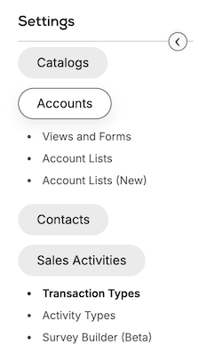

# ATD Editor (Object type editor)

## Overview
- After the addon installation, two entries are added to the Setting menu, under Sales Activities:

    - Transaction Types.
    - Activity Types.

- And another entry under Accounts:
    - Views & Forms.

The addon show a list of Transactions/Activities/Accounts types:

- When selecting one of the Transaction, the addon add Tabs container and an ABI container on the page and displays the desired content in it.

- Each tab can contain a legacy page content from the Wsim, in HTML Iframe or an Addon.

- The content is determined by the remote name param. If it is "legacy_settings", then the legacy setting addon is loaded and the desired ifram is displayed in it, otherwise the addon is loaded and displayed directly in the ABI.

- The tabs list consists of a hard coded list (from the model.ts file) that is combined with a list obtained from a server call that returns the addons that have a relation to the ATD editor addon.
        For example the Relation-items addon, that installed the 'TransactionTypeListTabs' relation. 

    ### Hard coded tabs list (model.ts file): ###

    | Tab | Description |
    |-------- |------------ |
    | [General](https://settings.pepperi.com/Views/Agents/OrdersTypes.aspx?objectUUID=277946&tabName=GENERAL) | Give the ability to  configure the Transaction Type Name & Description and select an icon for it (icon appears on the tablet). |
    | [Views](https://settings.pepperi.com/Views/Agents/OrdersTypes.aspx?objectUUID=277946&tabName=Views) | Configure the transaction layouts: Details, Cart & Footer |
    | [Actions](https://settings.pepperi.com/Views/Agents/OrdersTypes.aspx?objectUUID=277946&tabName=ACTIONS) | Configuration of the Duplicate transaction function |
    | [Workflow](https://settings.pepperi.com/Views/Agents/OrdersTypes.aspx?objectUUID=277946&tabName=WORKFLOW) | Add integration Workflow, triggered by an activity status changes |
    | [programs](https://settings.pepperi.com/Views/Agents/OrdersTypes.aspx?objectUUID=277946&tabName=PROGRAM) | Programs allow you to run Workflow actions independent of the actual Transaction Workflow and then run them from buttons or menus within the app. For example, add pop up notifications, alerts, or custom forms as buttons or menu options during the ordering process. Users can run these actions on demand |
    | [Settings](https://settings.pepperi.com/Views/Agents/OrdersTypes.aspx?objectUUID=277946&tabName=SETTINGS) | Add the ability to change many params of the transaction. [read more..](https://support.pepperi.com/hc/en-us/articles/201820207-Sales-Transaction-Types-Actions-Workflows-Programs-and-Settings#_Toc536721172)|
    | [Fields](https://settings.pepperi.com/Views/Agents/OrdersTypes.aspx?objectUUID=277946&tabName=FIELDS) | allows you to view existing, or create new fields for use in the various Transaction forms and layouts. Custom fields allow you to create additional fields as per your data requirements. [read more..](https://support.pepperi.com/hc/en-us/articles/201820207-Sales-Transaction-Types-Actions-Workflows-Programs-and-Settings#_Toc536721172) |

At the beginning, the addon loads the information about the first tab (eg general tab) and draws it in the ABI that is under the tabs. Each time you click on another tab, the ABI is cleaned and rebuilt with the new content for the selected tab.

---

## Infrastructure

The addon loads 'Legacy pages' with the Legacy settings addon. or load addons that have relation to atd editor in ABI container.

---

## Data Mode

- On the onInit (settings-tabs.component.ts) we take the type & ID of the activity from the this.route.snapshot.params.
- Then we brings the fixed tabs (hard coded) list from the model.ts file according to the type.
- We mearge those tabs with the tabs that we got from the server. (settings-tabs.component.ts line 88).
- from the ngAfterContentChecked we emit the Tab click event and show the first tab.
- On the tab click if the remote name is 'legacy_settings' we are running the Legacy Setting addon and build the iFrame URL according to the tab name & the ATD object. for example:
     - '"Views/Agents/OrdersTypes.aspx?objectUUID=266961&tabName=GENERAL&name=Sales Order&description=Default format for catalog orders&icon_name=icon9&share=true"'
- If it's not 'legacy_settings', we are loading the specipic addon on ABI with hostObject data & other params to the #addonBlockContainer (under the Tabs).
- When the User click on a different tab, the tab click event trigger from the begining and bring a different content to the ABI according to the tab. 

---

## PNS Usage

[Provide any PNS subscriptions or publishes done by the addon]

---

## Relations
The  [`relations.service.ts`](../server-side/services/relations.service.ts) is responsible for creating the relations .  
Existing relations:
- $SettingsBlock$ - settings relations - create settings tab for ATD editor addon.
- $TransactionTypeListMenu$ - add the Transaction Types entry,
- $ActivityTypeListMenu$ - add the Activity Types entry,
- $AccountTypeListMenu$ - add the Accounts Types entry
---

_____________________________________________________________
### CPI endpoints:

There is no CPI side.
_____________________________________________________________
#### Diagram

[Provide any diagrams relevant to topic1]
